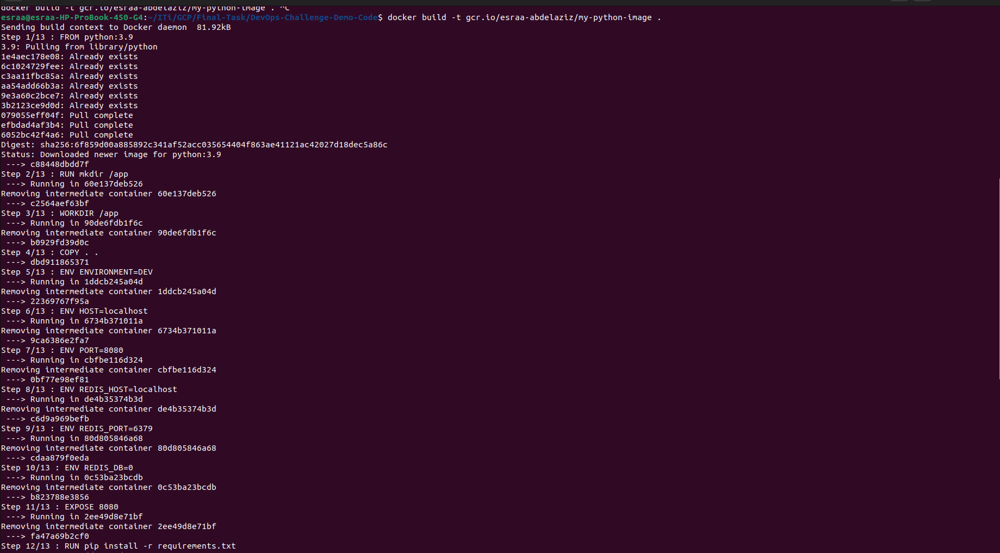

# GCP-Final-Task
Project Description:
Infrastructure consists of
- VPC contains:

   1-Management subnet has the following: • NAT gateway • Private VM

   2-Restricted subnet has the following: • Private standard GKE cluster (private control plan)
   
- Constraints:

   1-Restricted subnet must not have access to internet
   
   2-All images deployed on GKE must come from GCR or Artifacts registry.
   
   3-The VM must be private.
   
   4-Deployment must be exposed to public internet with a public HTTP load balancer.
   
   5-All infra is to be created on GCP using terraform.
   
   6-Deployment on GKE can be done by terraform or manually by kubectl tool.
   
   7-The code to be build/dockerized and pushed to GCR is on here: https://github.com/atefhares/DevOps-Challenge-Demo-Code
   
   8-Don’t use default compute service account while creating the gke cluster, create custom SA and attach it to your nodes.
   
   9-Only the management subnet can connect to the gke cluster.
   
 How to Use:

   *Don't forget to make sure you have the correct credentials set up to authenticate with GCP before running the terraform commands*

1-Clone the repository from https://github.com/atefhares/DevOps-Challenge-Demo-Code
   
     -Make a Dockerfile then build the Image
     -Push the Docker image of the application to GCR
     
2- Install Terraform.

3-Clone the repository from https://github.com/esraazizo/GCP-Final-Task 
       
 -Run terraform init to initialize the project
        
   
         
 -Run terraform plan to preview the changes that will be made.
        
   
       
 -Run terraform apply to create the resources.
        
   

4- Infrastructure screenshots from console.
   - vpc
   
     
 
   
   -vm 
   
   
    
    
   - cluster 
      
      
      
      
    
   - subnets
  
      

    
      
     
 
 5- Build image of python-app and push it to gcr 
   
      -docker build . -t gcr.io/<your-project-id>/my-python-app
     
   
     
   
     
6- Two images on gcr 
  
   

7- SSH into the private mangment VM and connect to the cluster.

     gcloud container clusters get-credentials python-cluster --zone <your-added-preferred-zone> --project <your-project-id>
   
8- Run deployment files and create pods and services 
     
     kubectl apply -f Deployment 
    
  -Screen of pods and services
   
  
    
9- Accessing the Python App
   
  
